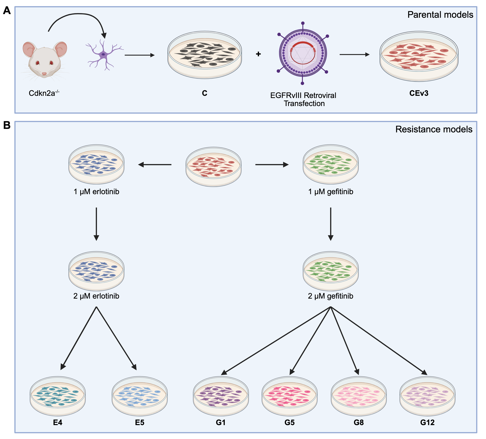
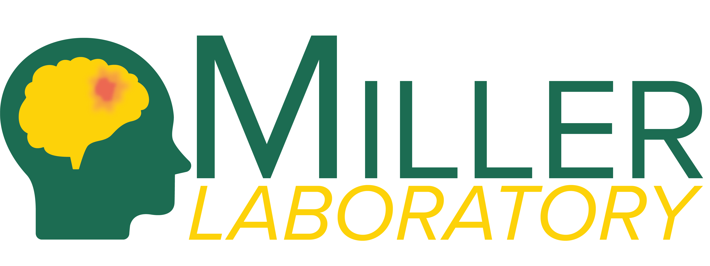

```{r setup, include=FALSE}
knitr::opts_chunk$set(echo = TRUE)
```

# Identifying and Exploiting Combinatorial Synthetic Lethality by Characterizing Adaptive Kinome Rewiring of EGFRvIII-driven Glioblastoma

### Project DOI

Peer-reviewed Manuscript: <br/>
Pending <br/>

Code for Manuscript: <br/>
[10.5281/zenodo.15677385](https://doi.org/10.5281/zenodo.15677385) <br/>

Code for Docker Container: <br/>
[10.5281/zenodo.15671657](https://doi.org/10.5281/zenodo.15671657) <br/>

## Authors
Benjamin Lin<sup>†1,2</sup>, Abigail K. Shelton<sup>†2</sup>, Erin Smithberger<sup>2</sup>, Julia Ziebro<sup>2</sup>, Kasey R. Skinner<sup>2</sup>, Ryan E. Bash<sup>2</sup>, Richard Kirkman<sup>2</sup>, Allie Stamper<sup>2</sup>, Madison Butler<sup>3</sup>, Alex Flores<sup>4</sup>, Steven P. Angus<sup>5</sup>, Michael P. East<sup>6</sup>, Timothy F. Cloughesy<sup>7</sup>, David A. Nathanson<sup>8</sup>, Michael E. Berens<sup>9</sup>, Jann N. Sarkaria<sup>10</sup>, Zev A. Binder<sup>11</sup>, Donald M. O’Rourke<sup>11</sup>, Timothy C Howton<sup>12</sup>, Brittany N. Lasseigne<sup>12,13,4</sup>, Christopher D. Willey<sup>13,15</sup>, Gary L. Johnson<sup>6</sup>, Anita B. Hjelmeland<sup>12,13,14</sup>, Frank B. Furnari<sup>16</sup>, C. Ryan Miller<sup>*2,13,14</sup>

<sup>†</sup> These authors have contributed equally to this work <br/>
<sup>*</sup> Corresponding author

Affiliations

1.	Medical Scientist Training Program, Heersink School of Medicine, University of Alabama at Birmingham, Birmingham, AL
2.	Department of Pathology, Division of Neuropathology, Heersink School of Medicine, University of Alabama at Birmingham, Birmingham, AL
3.	Department of Biology, University of North Carolina, Chapel Hill, NC
4.	University of North Carolina School of Medicine, Chapel Hill, NC
5.	Department of Pediatrics, Indiana University School of Medicine, Indianapolis, IN
6.	Department of Pharmacology, University of North Carolina School of Medicine, Chapel Hill, NC
7.	Department of Neurology, David Geffen School of Medicine, University of California, Los Angeles, Los Angeles, CA
8.	Department of Molecular and Medical Pharmacology, David Geffen School of Medicine, University of California, Los Angeles, Los Angeles, CA
9.	Cancer and Cell Biology Division, Translational Genomics Research Institute, Phoenix, AZ
10.	Department of Radiation Oncology, Mayo Clinic, Rochester, MN
11.	Department of Neurosurgery and Glioblastoma Translational Center of Excellence, Abramson Cancer Center, Perelman School of Medicine, University of Pennsylvania, Philadelphia, PA
12.	Department of Cell, Developmental and Integrative Biology, Heersink School of Medicine, University of Alabama at Birmingham, Birmingham, AL
13.	O’Neal Comprehensive Cancer Center, Heersink School of Medicine, University of Alabama at Birmingham, Birmingham, AL
14.	Comprehensive Neuroscience Center, Heersink School of Medicine, University of Alabama at Birmingham, Birmingham, AL
15.	Department of Radiation Oncology, University of Alabama at Birmingham, Birmingham, AL
16.	Department of Medicine, Division of Regenerative Medicine, University of California, San Diego, San Diego, CA


## Project Overview

### Model Generation
  <br/>
We temporally characterized drug-induced kinome rewiring in isogenic, genetically engineered Cdkn2a-deleted mouse astrocytes expressing human EGFRvIII (CEv3 cells), to identify synthetic lethality targets for upfront combinatorial therapy with EGFR tyrosine kinase inhibitors (TKI). Cdkn2a<sup>-/-</sup> mouse astrocytes were cultured and transduced with retrovirus encoding human EGFRvIII (Fig. S1A). Cell lines with acquired resistance to EGFR TKI (gefitinib or erlotinib) were generated in vitro through dose escalation (Fig. S1B). Figure from Lin et al., Acta Neuropathol. Commun., 2025. Figure generated with biorender.com. <br/>


### Temporal Kinomic Characterization
  <br/>

Kinomic profiling of cell lines after chronic and acute EGFR TKI treatment identifies unique kinase rewiring profiles between these two treatment conditions, acquired resistance vs. acute response. We bioinformatically established baseline acquired resistance and EGFR inhibitor (EGFRi) signatures from these kinase rewiring profiles. Further bioinformatics and molecular interrogation suggested a synergistic synthetic lethality when EGFRvIII and Cdk6 were targeted together in the upfront setting with combination therapy. Orthotopic allograft survival studies confirmed a synergistic increase in median survival when EGFRvIII and Cdk6 are targeted simultaneously. Figure generated with biorender.com.


## Code and data availability

### Raw RNA-sequencing data is deposited at the Gene Expression Omnibus. <br/>
GEO accession: GSE296151 <br/>

### Code for figure generation is hosted on the following Github Pages: <br/>
[https://benlin-uab.github.io/2025_Lin_ComboSyntheticLethality_Manuscript](https://benlin-uab.github.io/2025_Lin_ComboSyntheticLethality_Manuscript/) <br/>

### Docker image 
[benjaminlin1/240306_rstudio_4.3.2](https://hub.docker.com/r/benjaminlin1/240306_rstudio_4.3.2/tags) tag 3.0.0 is available on DockerHub. <br/>

### Docker container code   <br/>
[https://github.com/benlin-UAB/240306_Docker_R-4.3.2](https://github.com/benlin-UAB/240306_Docker_R-4.3.2)  <br/>
[](https://doi.org/10.5281/zenodo.15671657) <br/>

### Data analysis code <br/>
[https://github.com/benlin-UAB/2025_Lin_ComboSyntheticLethality_Manuscript](https://github.com/benlin-UAB/2025_Lin_ComboSyntheticLethality_Manuscript)  <br/>


### Conteptual DOI:
Conceptual DOI for Docker Container (All versions) [doi.org/10.5281/zenodo.15671571](https://doi.org/10.5281/zenodo.15671571) <br/>
Conceptual DOI for Data analysis (All versions) <br/>

## Preprocessing
FASTQ files were processed on the UAB Cheaha HPC using the RNA conda environment loaded with Anaconda3/2022.05.
```{bash echo=FALSE}
cat assets/preprocessing/240528_rna.yml
```

Alignment was performed with STAR:
```{bash echo=FALSE}
cat assets/preprocessing/star.sh
```

Quantification was performed with Salmon:
```{bash echo=FALSE}
cat assets/preprocessing/salmon.sh
```

## Downstream analysis scripts
1. 01_Setup.Rmd - Enviroment setup script
2. 02_MIB_Bl.Rmd - Exploratory Data Analysis (EDA) and DE analysis for MIB-MS baseline proteomics
3. 03_MIB_TMT.Rmd - EDA and DE analysis for MIB-MS TMT dynamic multiplex proteomics
4. 04_RNAseq.Rmd - EDA and DE analysis for RNA-seq
5. 05_MIBs_BL_sig.Rmd - EDA of the MIBs baseline signatures
6. 06_MIBs_DYN_sig.Rmd - EDA of the MIBs hEGFRi signatures
7. 07_mRNA_dynTKI.Rmd - EDA of the dynamic RNA-seq 
8. 2025_Lin_Figures.Rmd - Manuscript Figures 

### R Directory
```{r echo=FALSE}
fs::dir_tree("/Data/R_scripts/")
```

## Differential (DE) gene analysis
Rmarkdown for DE analysis are in the following files 02_MIB_Bl.Rmd, 03_MIB_TMT.Rmd, and 04_RNAseq.Rmd - EDA and DE analysis for RNA-seq. These RMD files generate the "Graphs" and "Output" directories.

### Graphs directory
```{r echo=FALSE}
fs::dir_tree("/Data/Graphs/", type="directory")
```

### Output directory
```{r echo=FALSE}
fs::dir_tree("/Data/Output/", type="directory")
```

## Manuscript Figures 
[https://benlin-uab.github.io/2025_Lin_ComboSyntheticLethality_Manuscript](https://benlin-uab.github.io/2025_Lin_ComboSyntheticLethality_Manuscript/) <br/>
Figures made in R were generated from this script "2025_Lin_Figures.Rmd" and written to "/Data/Figures/" directory

### Figures Directory
```{r echo=FALSE}
fs::dir_tree("/Data/Figures", type="directory")
```

## Reproduction instructions
We recommended installing and running with administrator privileges

1. Download and install [Docker Desktop](https://www.docker.com/products/docker-desktop/)

2. Download Docker image benjaminlin1/240306_rstudio_4.3.2 and pull tag 3.0.0.  <br/>
[https://github.com/benlin-UAB/240306_Docker_R-4.3.2](https://github.com/benlin-UAB/240306_Docker_R-4.3.2)  <br/>
[10.5281/zenodo.15671657](https://doi.org/10.5281/zenodo.15671657)   <br/>

3. Clone this Github Repository

4. Run image with the following settings:

    - Set port. Use "0" to randomly assign.
    - Mount the Github repo folder as a volume. 
      - Click the 3 dots in Host path
      - Navigate to the downloaded Github repository
      - Select the Github Repo folder 
    - Enter "/Data/" in Container path
    - (Optional) Set password with environment variable "PASSWORD". Type desired password in the "Value" field. 
    - (Optional) Set Name of container

5. Run container. Navigate to the localhost port in a web browser and login with the following:

    - username: "rstudio"
    - password: If randomly set, it will be displayed in the logs tab of the container in Docker Desktop

6. Open the R Project. Within the containerized R studio, navigate to "/Data/" folder.


## R version and R package information

```{r echo=FALSE}
info <- sessionInfo()
cat(paste("R version:", info$R.version$version.string), "\n")
cat(paste("Platform:", info$platform), "\n")
```


```{r echo=FALSE}
# List of installed packages
installed <- as.data.frame(installed.packages()[, c("Package", "Version")])
# Sort alphabetically
installed <- installed[order(installed$Package), ]
```

```{r echo=FALSE}
knitr::kable(installed)
```


## Miller Lab
 

[Miller Lab](https://sites.uab.edu/rmiller/) 

## Funding

BL is funded by the Medical Scientist Training Program at UAB Heersink School of Medicine through the National Institute of General Medical Sciences (NIGMS, T32GM008361). JZ is funded by the AMC21 Scholars Program from UAB Heersink School of Medicine and by a NextGen Scholars grant from the UAB O’Neal Comprehensive Cancer Center. KRS is funded by the National Cancer Institute (F31CA247177). DAN and TFC are funded by the Uncle Kory Foundation, Kurland Family Foundation, National Brain Tumor Society, Spiegelman Family Foundation in Memory of Barry Spiegelman, the National Institute of Neurological Disorders and Stroke (NINDS, R01NS121319), and the National Cancer Institute (NCI, R01CA227089, R01CA213133, R01CA270027, P50CA211015). JNS is funded by NCI (U01CA227954, U19CA264362) and the National Brain Tumor Society. ZAB is funded by NCI (R37CA285434). DMO is funded by The Templeton Family Initiative in Neuro-Oncology, The Maria and Gabriele Troiano Brain Cancer Immunotherapy Fund, The Herbert & Diane Bischoff Fund, and NINDS (R01NS042645). FBF is funded by the NINDS (R01NS080939, R01NS116802). DMO, FBF, and CRM are funded by NCI (R01CA258248). FBF and CRM are funded by NINDS (R01NS134798). MEB, GLJ, and CRM are funded by NCI (R01CA204136). ABH is funded by NINDS (R01NS127424). The UAB O’Neal Comprehensive Cancer Center also funded CRM through the O’Neal Invests program, supported by NCI (P30CA013148). The UAB high performance computing group is supported by NSF (OAC-1541310).

## Acknowledgements 

We thank Miller, Johnson, and Furnari lab members for their expertise and thoughtful discussions. We thank Michael Crowley and members of the core lab in the UAB Heflin Center for Genomic Sciences. We gratefully acknowledge resources provided by the UAB Research Computing group for high-performance computing (HPC) support and computing time on the Cheaha cluster.