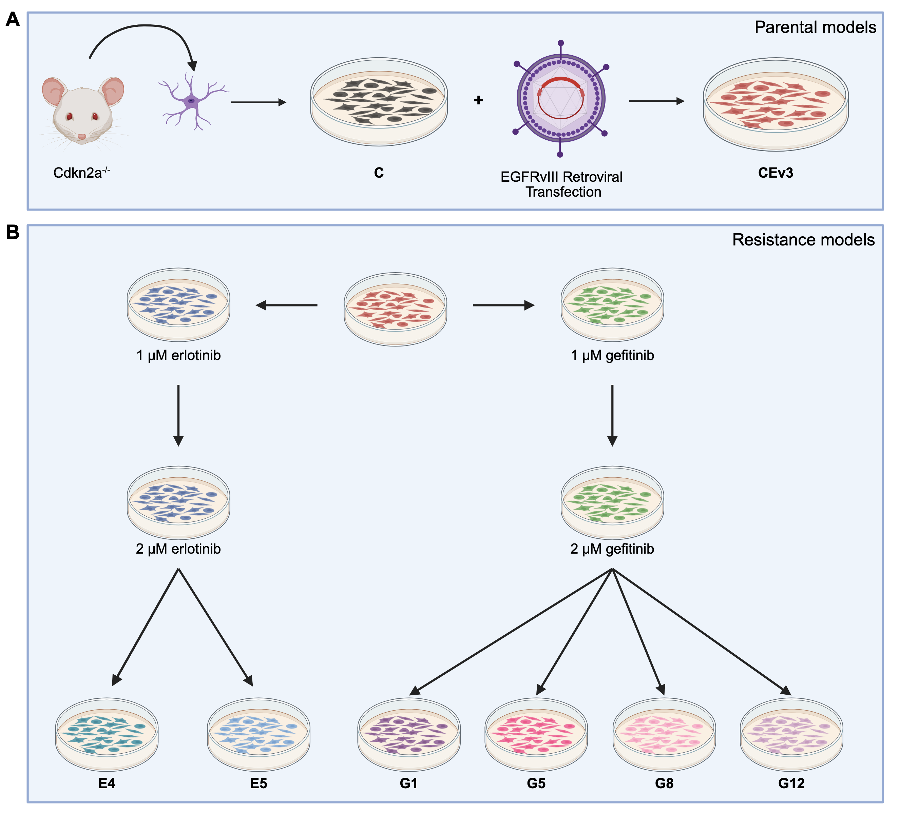

README
================
Benjamin Lin and C Ryan Miller  
2025-06-24

# Identifying and Exploiting Combinatorial Synthetic Lethality by Characterizing Adaptive Kinome Rewiring of EGFRvIII-driven Glioblastoma

Peer-reviewed Manuscript:   Pending  

Code for Manuscript:   <https://doi.org/10.5281/zenodo.15677385>
 

Code for Docker Container:  
<https://doi.org/10.5281/zenodo.15671657>  

## Authors

Benjamin Lin†1,2, Abigail K. Shelton†2, Erin
Smithberger2, Julia Ziebro2, Kasey R.
Skinner2, Ryan E. Bash2, Richard
Kirkman2, Allie Stamper2, Madison
Butler3, Alex Flores4, Steven P.
Angus5, Michael P. East6, Timothy F.
Cloughesy7, David A. Nathanson8, Michael E.
Berens9, Jann N. Sarkaria10, Zev A.
Binder11, Donald M. O’Rourke11, Timothy C
Howton12, Brittany N. Lasseigne12,13,4,
Christopher D. Willey13,15, Gary L. Johnson6,
Anita B. Hjelmeland12,13,14, Frank B. Furnari16,
C. Ryan Miller\*2,13,14

† These authors have contributed equally to this work  
\* Corresponding author

Affiliations

1.  Medical Scientist Training Program, Heersink School of Medicine,
    University of Alabama at Birmingham, Birmingham, AL
2.  Department of Pathology, Division of Neuropathology, Heersink School
    of Medicine, University of Alabama at Birmingham, Birmingham, AL
3.  Department of Biology, University of North Carolina, Chapel Hill, NC
4.  University of North Carolina School of Medicine, Chapel Hill, NC
5.  Department of Pediatrics, Indiana University School of Medicine,
    Indianapolis, IN
6.  Department of Pharmacology, University of North Carolina School of
    Medicine, Chapel Hill, NC
7.  Department of Neurology, David Geffen School of Medicine, University
    of California, Los Angeles, Los Angeles, CA
8.  Department of Molecular and Medical Pharmacology, David Geffen
    School of Medicine, University of California, Los Angeles, Los
    Angeles, CA
9.  Cancer and Cell Biology Division, Translational Genomics Research
    Institute, Phoenix, AZ
10. Department of Radiation Oncology, Mayo Clinic, Rochester, MN
11. Department of Neurosurgery and Glioblastoma Translational Center of
    Excellence, Abramson Cancer Center, Perelman School of Medicine,
    University of Pennsylvania, Philadelphia, PA
12. Department of Cell, Developmental and Integrative Biology, Heersink
    School of Medicine, University of Alabama at Birmingham, Birmingham,
    AL
13. O’Neal Comprehensive Cancer Center, Heersink School of Medicine,
    University of Alabama at Birmingham, Birmingham, AL
14. Comprehensive Neuroscience Center, Heersink School of Medicine,
    University of Alabama at Birmingham, Birmingham, AL
15. Department of Radiation Oncology, University of Alabama at
    Birmingham, Birmingham, AL
16. Department of Medicine, Division of Regenerative Medicine,
    University of California, San Diego, San Diego, CA

## Project Overview

### Model Generation

  We temporally characterized drug-induced kinome rewiring in
isogenic, genetically engineered Cdkn2a-deleted mouse astrocytes
expressing human EGFRvIII (CEv3 cells), to identify synthetic lethality
targets for upfront combinatorial therapy with EGFR tyrosine kinase
inhibitors (TKI). Cdkn2a-/- mouse astrocytes were cultured
and transduced with retrovirus encoding human EGFRvIII (Fig. S1A). Cell
lines with acquired resistance to EGFR TKI (gefitinib or erlotinib) were
generated in vitro through dose escalation (Fig. S1B). Figure from Lin
et al., Acta Neuropathol. Commun., 2025. Figure generated with
biorender.com.  

### Temporal Kinomic Characterization

 

Kinomic profiling of cell lines after chronic and acute EGFR TKI
treatment identifies unique kinase rewiring profiles between these two
treatment conditions, acquired resistance vs. acute response. We
bioinformatically established baseline acquired resistance and EGFR
inhibitor (EGFRi) signatures from these kinase rewiring profiles.
Further bioinformatics and molecular interrogation suggested a
synergistic synthetic lethality when EGFRvIII and Cdk6 were targeted
together in the upfront setting with combination therapy. Orthotopic
allograft survival studies confirmed a synergistic increase in median
survival when EGFRvIII and Cdk6 are targeted simultaneously. Figure
generated with biorender.com.

## Code and data availability

### Raw RNA-sequencing data is deposited at the Gene Expression Omnibus.  

GEO accession: GSE296151  

### Code for figure generation is hosted on the following Github Pages:  

[https://benlin-uab.github.io/2025_Lin_ComboSyntheticLethality_Manuscript](https://benlin-uab.github.io/2025_Lin_ComboSyntheticLethality_Manuscript/)
 

### Docker image

[benjaminlin1/240306_rstudio_4.3.2](https://hub.docker.com/r/benjaminlin1/240306_rstudio_4.3.2/tags)
tag 3.0.0 is available on DockerHub.  

### Docker container code  

<https://github.com/benlin-UAB/240306_Docker_R-4.3.2>  

 

### Data analysis code  

<https://github.com/benlin-UAB/2025_Lin_ComboSyntheticLethality_Manuscript>
 

### Conteptual DOI:

Conceptual DOI for Docker Container (All versions)
[doi.org/10.5281/zenodo.15671571](https://doi.org/10.5281/zenodo.15671571)
  Conceptual DOI for Data analysis (All versions)  

## Preprocessing

FASTQ files were processed on the UAB Cheaha HPC using the RNA conda
environment loaded with Anaconda3/2022.05.

    ## name: RNA
    ## channels:
    ##   - bih-cubi
    ##   - bioconda
    ##   - conda-forge
    ##   - defaults
    ## dependencies:
    ##   - _libgcc_mutex=0.1=conda_forge
    ##   - _openmp_mutex=4.5=2_gnu
    ##   - bcl2fastq2=2.20.0.422=2
    ##   - boost-cpp=1.74.0=h6cacc03_7
    ##   - brotli=1.0.9=h166bdaf_8
    ##   - brotli-bin=1.0.9=h166bdaf_8
    ##   - bzip2=1.0.8=h7f98852_4
    ##   - c-ares=1.19.1=hd590300_0
    ##   - ca-certificates=2023.5.7=hbcca054_0
    ##   - certifi=2023.5.7=pyhd8ed1ab_0
    ##   - charset-normalizer=3.1.0=pyhd8ed1ab_0
    ##   - click=8.1.3=unix_pyhd8ed1ab_2
    ##   - coloredlogs=15.0.1=pyhd8ed1ab_3
    ##   - colormath=3.0.0=py_2
    ##   - contourpy=1.0.7=py310hdf3cbec_0
    ##   - cycler=0.11.0=pyhd8ed1ab_0
    ##   - expat=2.5.0=hcb278e6_1
    ##   - fastqc=0.11.9=hdfd78af_1
    ##   - font-ttf-dejavu-sans-mono=2.37=hab24e00_0
    ##   - fontconfig=2.14.2=h14ed4e7_0
    ##   - fonttools=4.39.4=py310h2372a71_0
    ##   - freetype=2.12.1=hca18f0e_1
    ##   - future=0.18.3=pyhd8ed1ab_0
    ##   - htslib=1.17=h81da01d_2
    ##   - humanfriendly=10.0=py310hff52083_4
    ##   - icu=69.1=h9c3ff4c_0
    ##   - idna=3.4=pyhd8ed1ab_0
    ##   - importlib-metadata=6.6.0=pyha770c72_0
    ##   - jinja2=3.1.2=pyhd8ed1ab_1
    ##   - keyutils=1.6.1=h166bdaf_0
    ##   - kiwisolver=1.4.4=py310hbf28c38_1
    ##   - krb5=1.20.1=h81ceb04_0
    ##   - lcms2=2.15=haa2dc70_1
    ##   - ld_impl_linux-64=2.40=h41732ed_0
    ##   - lerc=4.0.0=h27087fc_0
    ##   - libblas=3.9.0=16_linux64_openblas
    ##   - libbrotlicommon=1.0.9=h166bdaf_8
    ##   - libbrotlidec=1.0.9=h166bdaf_8
    ##   - libbrotlienc=1.0.9=h166bdaf_8
    ##   - libcblas=3.9.0=16_linux64_openblas
    ##   - libcurl=8.1.1=h409715c_0
    ##   - libdeflate=1.18=h0b41bf4_0
    ##   - libedit=3.1.20191231=he28a2e2_2
    ##   - libev=4.33=h516909a_1
    ##   - libexpat=2.5.0=hcb278e6_1
    ##   - libffi=3.4.2=h7f98852_5
    ##   - libgcc=7.2.0=h69d50b8_2
    ##   - libgcc-ng=12.2.0=h65d4601_19
    ##   - libgfortran-ng=12.2.0=h69a702a_19
    ##   - libgfortran5=12.2.0=h337968e_19
    ##   - libgomp=12.2.0=h65d4601_19
    ##   - libjemalloc=5.3.0=hcb278e6_0
    ##   - libjpeg-turbo=2.1.5.1=h0b41bf4_0
    ##   - liblapack=3.9.0=16_linux64_openblas
    ##   - libnghttp2=1.52.0=h61bc06f_0
    ##   - libnsl=2.0.0=h7f98852_0
    ##   - libopenblas=0.3.21=pthreads_h78a6416_3
    ##   - libpng=1.6.39=h753d276_0
    ##   - libsqlite=3.42.0=h2797004_0
    ##   - libssh2=1.10.0=hf14f497_3
    ##   - libstdcxx-ng=12.2.0=h46fd767_19
    ##   - libtiff=4.5.0=ha587672_6
    ##   - libuuid=2.38.1=h0b41bf4_0
    ##   - libwebp-base=1.3.0=h0b41bf4_0
    ##   - libxcb=1.15=h0b41bf4_0
    ##   - libzlib=1.2.13=h166bdaf_4
    ##   - lzstring=1.0.4=py_1001
    ##   - markdown=3.4.3=pyhd8ed1ab_0
    ##   - markdown-it-py=2.2.0=pyhd8ed1ab_0
    ##   - markupsafe=2.1.2=py310h1fa729e_0
    ##   - matplotlib-base=3.7.1=py310he60537e_0
    ##   - mdurl=0.1.0=pyhd8ed1ab_0
    ##   - multiqc=1.13=pyhdfd78af_0
    ##   - munkres=1.0.7=py_1
    ##   - ncurses=6.3=h27087fc_1
    ##   - networkx=3.1=pyhd8ed1ab_0
    ##   - numpy=1.24.3=py310ha4c1d20_0
    ##   - openjdk=11.0.1=h516909a_1016
    ##   - openjpeg=2.5.0=hfec8fc6_2
    ##   - openssl=3.1.0=hd590300_3
    ##   - packaging=23.1=pyhd8ed1ab_0
    ##   - perl=5.32.1=2_h7f98852_perl5
    ##   - pillow=9.5.0=py310h582fbeb_1
    ##   - pip=23.1.2=pyhd8ed1ab_0
    ##   - pthread-stubs=0.4=h36c2ea0_1001
    ##   - pygments=2.15.1=pyhd8ed1ab_0
    ##   - pyparsing=3.0.9=pyhd8ed1ab_0
    ##   - pysocks=1.7.1=pyha2e5f31_6
    ##   - python=3.10.11=he550d4f_0_cpython
    ##   - python-dateutil=2.8.2=pyhd8ed1ab_0
    ##   - python_abi=3.10=3_cp310
    ##   - pyyaml=6.0=py310h5764c6d_5
    ##   - readline=8.2=h8228510_1
    ##   - requests=2.31.0=pyhd8ed1ab_0
    ##   - rich=13.3.5=pyhd8ed1ab_0
    ##   - rich-click=1.6.1=pyhd8ed1ab_0
    ##   - salmon=1.10.1=h7e5ed60_0
    ##   - samtools=1.17=hd87286a_1
    ##   - setuptools=67.7.2=pyhd8ed1ab_0
    ##   - simplejson=3.19.1=py310h1fa729e_0
    ##   - six=1.16.0=pyh6c4a22f_0
    ##   - spectra=0.0.11=py_1
    ##   - star=2.7.10b=h9ee0642_0
    ##   - tbb=2021.7.0=h924138e_0
    ##   - tk=8.6.12=h27826a3_0
    ##   - typing_extensions=4.6.1=pyha770c72_0
    ##   - tzdata=2023c=h71feb2d_0
    ##   - unicodedata2=15.0.0=py310h5764c6d_0
    ##   - urllib3=2.0.2=pyhd8ed1ab_0
    ##   - wheel=0.40.0=pyhd8ed1ab_0
    ##   - xorg-libxau=1.0.11=hd590300_0
    ##   - xorg-libxdmcp=1.1.3=h7f98852_0
    ##   - xz=5.2.6=h166bdaf_0
    ##   - yaml=0.2.5=h7f98852_2
    ##   - zipp=3.15.0=pyhd8ed1ab_0
    ##   - zlib=1.2.13=h166bdaf_4
    ##   - zstd=1.5.2=h3eb15da_6
    ## prefix: /home/benlin/.conda/envs/RNA

Alignment was performed with STAR:

    ## #!/bin/bash
    ## 
    ## ## Script written by Benjamin Lin (benlin@uab.edu) on 9-16-22
    ## ## Benjamin Lin 
    ## ## Miller Lab
    ## 
    ## ## conda env RNA
    ## 
    ## # TODO file contains a list of all the FASTQ files
    ## TODO="starTodo.txt"
    ## 
    ## ## Programs
    ## MYBIN="~/.conda/envs/RNA/bin/STAR"
    ## 
    ## 
    ## ### Get file info
    ## printf "SLURM ARRAY TASK ID: %s\n" $SLURM_ARRAY_TASK_ID
    ## R1=`awk -v line=$SLURM_ARRAY_TASK_ID '{if (NR == line) print $0}' $TODO`
    ## 
    ## cmd="$MYBIN --genomeDir $GenomeDir \
    ##         --readFilesIn $IN/$R1 \
    ##         --outFileNamePrefix $OUT/$R1. \
    ##         --outSAMunmapped Within \
    ##         --outSAMtype BAM Unsorted SortedByCoordinate \
    ##         --quantMode TranscriptomeSAM \
    ##         --runThreadN 4 \
    ##         --readFilesCommand zcat"
    ## 
    ## echo "Executing STAR alignment"
    ## echo $cmd
    ## eval $cmd
    ## 

Quantification was performed with Salmon:

    ## #!/bin/bash
    ## 
    ## ## Script written by Benjamin Lin (benlin@uab.edu) on 9-19-22
    ## ## Benjamin Lin 
    ## ## Miller Lab
    ## 
    ## ## conda env RNA
    ## 
    ## # TODO file contains a list of all the star aligned Bam files (--quantMode TranscriptomeSAM)
    ## TODO="salmon.txt"
    ## 
    ## # Getting file names
    ## printf "SLURM ARRAY TASK ID: %s\n" $SLURM_ARRAY_TASK_ID
    ## FILE=`awk -v line=$SLURM_ARRAY_TASK_ID '{if (NR == line) print $0}' $TODO`
    ## CURRFILE=${FILE%%.fastq.gz*}
    ## 
    ## MYBIN="~/.conda/envs/RNA/bin/salmon"
    ## 
    ## cmd="$MYBIN quant -t $ref \
    ##         -l SR \
    ##         -a $IN/$FILE \
    ##         -o $OUT/$CURRFILE.salmon"
    ## 
    ## echo "Runing salmon quant"
    ## echo $cmd
    ## eval $cmd
    ## 
    ## 
    ## 

## Downstream analysis scripts

1.  01_Setup.Rmd - Enviroment setup script
2.  02_MIB_Bl.Rmd - Exploratory Data Analysis (EDA) and DE analysis for
    MIB-MS baseline proteomics
3.  03_MIB_TMT.Rmd - EDA and DE analysis for MIB-MS TMT dynamic
    multiplex proteomics
4.  04_RNAseq.Rmd - EDA and DE analysis for RNA-seq
5.  05_MIBs_BL_sig.Rmd - EDA of the MIBs baseline signatures
6.  06_MIBs_DYN_sig.Rmd - EDA of the MIBs hEGFRi signatures
7.  07_mRNA_dynTKI.Rmd - EDA of the dynamic RNA-seq
8.  2025_Lin_Figures.Rmd - Manuscript Figures

### R Directory

    ## /Data/R_scripts/
    ## ├── 00_Files_Check.Rmd
    ## ├── 00_Files_Check.html
    ## ├── 01_Setup.Rmd
    ## ├── 01_Setup.html
    ## ├── 02_MIB_Bl.Rmd
    ## ├── 02_MIB_Bl.html
    ## ├── 03_MIB_TMT.Rmd
    ## ├── 03_MIB_TMT.html
    ## ├── 04_RNAseq.Rmd
    ## ├── 04_RNAseq.html
    ## ├── 05_MIBs_BL_sig.Rmd
    ## ├── 05_MIBs_BL_sig.html
    ## ├── 06_MIBs_DYN_sig.Rmd
    ## ├── 06_MIBs_DYN_sig.html
    ## ├── 07_mRNA_dynTKI.Rmd
    ## ├── 07_mRNA_dynTKI.html
    ## ├── 2025_Lin_Figures.Rmd
    ## ├── 2025_Lin_Figures.html
    ## ├── 2025_Lin_Figures_Placeholder.Rmd
    ## ├── 2025_Lin_Figures_Placeholder.html
    ## ├── 2025_Render.R
    ## └── Data.Rproj

## Differential (DE) gene analysis

Rmarkdown for DE analysis is “/Data/R_scripts/2024_Lin_ANC_DE_analysis”.
This RMD file generates the “Graphs” and “Output” directories

### Graphs directory

    ## /Data/Graphs/
    ## ├── MIB-BL
    ## │   ├── DEP_BL_Res
    ## │   │   ├── Heatmap_TVG
    ## │   │   ├── Limma_res
    ## │   │   └── volcano
    ## │   ├── DEP_Bl_Par
    ## │   │   ├── Heatmap_TVG
    ## │   │   ├── Limma_res
    ## │   │   └── volcano
    ## │   ├── DEP_Bl_Par_fs
    ## │   │   ├── Limma_res
    ## │   │   └── volcano
    ## │   ├── DEP_Bl_Par_ss
    ## │   │   ├── Limma_res
    ## │   │   └── volcano
    ## │   ├── DEP_Bl_Res_fs
    ## │   │   ├── Limma_res
    ## │   │   └── volcano
    ## │   ├── DEP_Bl_Res_ss
    ## │   │   └── Limma_res
    ## │   ├── DEP_EDA_subset
    ## │   │   ├── bl_Par
    ## │   │   │   ├── normCounts
    ## │   │   │   └── normCounts_MV
    ## │   │   ├── bl_Par_fs
    ## │   │   │   ├── normCounts
    ## │   │   │   └── normCounts_MV
    ## │   │   ├── bl_Par_ss
    ## │   │   │   ├── normCounts
    ## │   │   │   └── normCounts_MV
    ## │   │   ├── bl_Res
    ## │   │   │   ├── normCounts
    ## │   │   │   └── normCounts_MV
    ## │   │   ├── bl_Res_fs
    ## │   │   │   ├── normCounts
    ## │   │   │   └── normCounts_MV
    ## │   │   └── bl_Res_ss
    ## │   │       ├── normCounts
    ## │   │       └── normCounts_MV
    ## │   └── DEP_all
    ## │       └── Limma_res
    ## ├── MIB-DYN
    ## │   ├── DEP_TMT_BL_Res
    ## │   │   ├── Heatmap_TVG
    ## │   │   ├── Limma_res
    ## │   │   └── volcano
    ## │   ├── DEP_TMT_EDA
    ## │   │   ├── C
    ## │   │   │   ├── Limma_res
    ## │   │   │   ├── normCounts
    ## │   │   │   ├── normCounts_MV
    ## │   │   │   └── volcano
    ## │   │   ├── CEv3
    ## │   │   │   ├── Limma_res
    ## │   │   │   ├── normCounts
    ## │   │   │   ├── normCounts_MV
    ## │   │   │   └── volcano
    ## │   │   ├── E4
    ## │   │   │   ├── Limma_res
    ## │   │   │   ├── normCounts
    ## │   │   │   ├── normCounts_MV
    ## │   │   │   └── volcano
    ## │   │   ├── E5
    ## │   │   │   ├── Limma_res
    ## │   │   │   ├── normCounts
    ## │   │   │   ├── normCounts_MV
    ## │   │   │   └── volcano
    ## │   │   ├── G1
    ## │   │   │   ├── Limma_res
    ## │   │   │   ├── normCounts
    ## │   │   │   ├── normCounts_MV
    ## │   │   │   └── volcano
    ## │   │   ├── G12
    ## │   │   │   ├── Limma_res
    ## │   │   │   ├── normCounts
    ## │   │   │   ├── normCounts_MV
    ## │   │   │   └── volcano
    ## │   │   ├── G5
    ## │   │   │   ├── Limma_res
    ## │   │   │   ├── normCounts
    ## │   │   │   ├── normCounts_MV
    ## │   │   │   └── volcano
    ## │   │   ├── G8
    ## │   │   │   ├── Limma_res
    ## │   │   │   ├── normCounts
    ## │   │   │   ├── normCounts_MV
    ## │   │   │   └── volcano
    ## │   │   ├── TMT_samples_BL_Res
    ## │   │   │   ├── Limma_res
    ## │   │   │   ├── normCounts
    ## │   │   │   ├── normCounts_MV
    ## │   │   │   └── volcano
    ## │   │   ├── TMT_samples_Par
    ## │   │   │   ├── Limma_res
    ## │   │   │   ├── normCounts
    ## │   │   │   ├── normCounts_MV
    ## │   │   │   └── volcano
    ## │   │   └── TMT_samples_Res
    ## │   │       ├── Limma_res
    ## │   │       ├── normCounts
    ## │   │       ├── normCounts_MV
    ## │   │       └── volcano
    ## │   ├── DEP_TMT_Par
    ## │   │   ├── Heatmap_TVG
    ## │   │   ├── Limma_res
    ## │   │   └── volcano
    ## │   ├── DEP_TMT_Res
    ## │   │   ├── Heatmap_TVG
    ## │   │   ├── Limma_res
    ## │   │   └── volcano
    ## │   └── DEP_TMT_all
    ## │       └── Limma_res
    ## ├── MIB_BL_sig
    ## │   ├── DEP_Bl_Res_fs
    ## │   ├── DEP_Bl_Res_ss
    ## │   ├── crossing
    ## │   ├── ss_fs_ol
    ## │   └── ss_fs_unique
    ## ├── MIBs_TMT_Clustering_sig
    ## │   ├── CEv3
    ## │   ├── E4
    ## │   ├── E5
    ## │   ├── G1
    ## │   ├── G12
    ## │   ├── G5
    ## │   └── G8
    ## ├── RNA
    ## │   ├── dds_EDA_subset
    ## │   │   ├── Afat_CEv3_starve
    ## │   │   │   ├── Heatmap_TVG
    ## │   │   │   ├── normCounts
    ## │   │   │   └── volcano
    ## │   │   ├── Afat_Res
    ## │   │   │   ├── Heatmap_TVG
    ## │   │   │   ├── normCounts
    ## │   │   │   └── volcano
    ## │   │   ├── Afat_Res_fs
    ## │   │   │   ├── Heatmap_TVG
    ## │   │   │   ├── normCounts
    ## │   │   │   └── volcano
    ## │   │   ├── Afat_Res_ss
    ## │   │   │   ├── Heatmap_TVG
    ## │   │   │   ├── normCounts
    ## │   │   │   └── volcano
    ## │   │   ├── Ner_CEv3_1_starve
    ## │   │   │   ├── Heatmap_TVG
    ## │   │   │   ├── normCounts
    ## │   │   │   └── volcano
    ## │   │   ├── bl_Par
    ## │   │   │   ├── Heatmap_TVG
    ## │   │   │   ├── normCounts
    ## │   │   │   └── volcano
    ## │   │   ├── bl_Par_fs
    ## │   │   │   ├── Heatmap_TVG
    ## │   │   │   ├── normCounts
    ## │   │   │   └── volcano
    ## │   │   ├── bl_Par_ss
    ## │   │   │   ├── Heatmap_TVG
    ## │   │   │   ├── normCounts
    ## │   │   │   └── volcano
    ## │   │   ├── bl_Res_fs
    ## │   │   │   ├── Heatmap_TVG
    ## │   │   │   ├── normCounts
    ## │   │   │   └── volcano
    ## │   │   └── bl_Res_ss
    ## │   │       ├── Heatmap_TVG
    ## │   │       ├── normCounts
    ## │   │       └── volcano
    ## │   ├── dds_all
    ## │   └── dds_filter
    ## └── mRNA_dynTKI
    ##     ├── Afat_dyn
    ##     ├── All_sig
    ##     ├── Ner_dyn
    ##     └── Sig_Clustering
    ##         ├── Afatinib
    ##         ├── Neratinib
    ##         ├── gProfiler2_mRNA_Afat_down
    ##         ├── gProfiler2_mRNA_Afat_up
    ##         ├── gProfiler2_mRNA_Ner_down
    ##         ├── gProfiler2_mRNA_Ner_up
    ##         ├── gProfiler2_mRNA_OL_down
    ##         └── gProfiler2_mRNA_OL_up

### Output directory

    ## /Data/Output/
    ## ├── MIB-BL
    ## │   ├── DEP_BL_Res
    ## │   │   ├── Heatmap_TVG
    ## │   │   └── Limma_res
    ## │   ├── DEP_Bl_Par
    ## │   │   ├── Heatmap_TVG
    ## │   │   └── Limma_res
    ## │   ├── DEP_Bl_Par_fs
    ## │   │   └── Limma_res
    ## │   ├── DEP_Bl_Par_ss
    ## │   │   └── Limma_res
    ## │   ├── DEP_Bl_Res_fs
    ## │   │   └── Limma_res
    ## │   ├── DEP_Bl_Res_ss
    ## │   │   └── Limma_res
    ## │   ├── DEP_EDA_subset
    ## │   │   ├── bl_Par
    ## │   │   │   ├── normCounts
    ## │   │   │   └── normCounts_MV
    ## │   │   ├── bl_Par_fs
    ## │   │   │   ├── normCounts
    ## │   │   │   └── normCounts_MV
    ## │   │   ├── bl_Par_ss
    ## │   │   │   ├── normCounts
    ## │   │   │   └── normCounts_MV
    ## │   │   ├── bl_Res
    ## │   │   │   ├── normCounts
    ## │   │   │   └── normCounts_MV
    ## │   │   ├── bl_Res_fs
    ## │   │   │   ├── normCounts
    ## │   │   │   └── normCounts_MV
    ## │   │   └── bl_Res_ss
    ## │   │       ├── normCounts
    ## │   │       └── normCounts_MV
    ## │   └── DEP_all
    ## │       └── Limma_res
    ## ├── MIB-DYN
    ## │   ├── DEP_TMT_BL_Res
    ## │   │   ├── Heatmap_TVG
    ## │   │   └── Limma_res
    ## │   ├── DEP_TMT_EDA
    ## │   │   ├── C
    ## │   │   │   ├── Limma_res
    ## │   │   │   ├── normCounts
    ## │   │   │   └── normCounts_MV
    ## │   │   ├── CEv3
    ## │   │   │   ├── Limma_res
    ## │   │   │   ├── normCounts
    ## │   │   │   └── normCounts_MV
    ## │   │   ├── E4
    ## │   │   │   ├── Limma_res
    ## │   │   │   ├── normCounts
    ## │   │   │   └── normCounts_MV
    ## │   │   ├── E5
    ## │   │   │   ├── Limma_res
    ## │   │   │   ├── normCounts
    ## │   │   │   └── normCounts_MV
    ## │   │   ├── G1
    ## │   │   │   ├── Limma_res
    ## │   │   │   ├── normCounts
    ## │   │   │   └── normCounts_MV
    ## │   │   ├── G12
    ## │   │   │   ├── Limma_res
    ## │   │   │   ├── normCounts
    ## │   │   │   └── normCounts_MV
    ## │   │   ├── G5
    ## │   │   │   ├── Limma_res
    ## │   │   │   ├── normCounts
    ## │   │   │   └── normCounts_MV
    ## │   │   ├── G8
    ## │   │   │   ├── Limma_res
    ## │   │   │   ├── normCounts
    ## │   │   │   └── normCounts_MV
    ## │   │   ├── TMT_samples_BL_Res
    ## │   │   │   ├── Limma_res
    ## │   │   │   ├── normCounts
    ## │   │   │   └── normCounts_MV
    ## │   │   ├── TMT_samples_Par
    ## │   │   │   ├── Limma_res
    ## │   │   │   ├── normCounts
    ## │   │   │   └── normCounts_MV
    ## │   │   └── TMT_samples_Res
    ## │   │       ├── Limma_res
    ## │   │       ├── normCounts
    ## │   │       └── normCounts_MV
    ## │   ├── DEP_TMT_Par
    ## │   │   ├── Heatmap_TVG
    ## │   │   └── Limma_res
    ## │   ├── DEP_TMT_Res
    ## │   │   ├── Heatmap_TVG
    ## │   │   └── Limma_res
    ## │   └── DEP_TMT_all
    ## │       └── Limma_res
    ## ├── MIB_BL_sig
    ## │   ├── DEP_Bl_Res_fs
    ## │   ├── DEP_Bl_Res_ss
    ## │   ├── crossing
    ## │   ├── ss_fs_ol
    ## │   └── ss_fs_unique
    ## ├── MIBs_TMT_Clustering_sig
    ## │   ├── CEv3
    ## │   ├── E4
    ## │   ├── E5
    ## │   ├── G1
    ## │   ├── G12
    ## │   ├── G5
    ## │   └── G8
    ## ├── RNA
    ## │   ├── dds_EDA_subset
    ## │   │   ├── Afat_CEv3_starve
    ## │   │   │   ├── DE2_res
    ## │   │   │   ├── DE2_res_ashr
    ## │   │   │   ├── Heatmap_TVG
    ## │   │   │   └── normCounts
    ## │   │   ├── Afat_Res
    ## │   │   │   ├── DE2_res
    ## │   │   │   ├── DE2_res_ashr
    ## │   │   │   ├── Heatmap_TVG
    ## │   │   │   └── normCounts
    ## │   │   ├── Afat_Res_fs
    ## │   │   │   ├── DE2_res
    ## │   │   │   ├── DE2_res_ashr
    ## │   │   │   ├── Heatmap_TVG
    ## │   │   │   └── normCounts
    ## │   │   ├── Afat_Res_ss
    ## │   │   │   ├── DE2_res
    ## │   │   │   ├── DE2_res_ashr
    ## │   │   │   ├── Heatmap_TVG
    ## │   │   │   └── normCounts
    ## │   │   ├── Ner_CEv3_1_starve
    ## │   │   │   ├── DE2_res
    ## │   │   │   ├── DE2_res_ashr
    ## │   │   │   ├── Heatmap_TVG
    ## │   │   │   └── normCounts
    ## │   │   ├── bl_Par
    ## │   │   │   ├── DE2_res
    ## │   │   │   ├── DE2_res_ashr
    ## │   │   │   ├── Heatmap_TVG
    ## │   │   │   └── normCounts
    ## │   │   ├── bl_Par_fs
    ## │   │   │   ├── DE2_res
    ## │   │   │   ├── DE2_res_ashr
    ## │   │   │   ├── Heatmap_TVG
    ## │   │   │   └── normCounts
    ## │   │   ├── bl_Par_ss
    ## │   │   │   ├── DE2_res
    ## │   │   │   ├── DE2_res_ashr
    ## │   │   │   ├── Heatmap_TVG
    ## │   │   │   └── normCounts
    ## │   │   ├── bl_Res_fs
    ## │   │   │   ├── DE2_res
    ## │   │   │   ├── DE2_res_ashr
    ## │   │   │   ├── Heatmap_TVG
    ## │   │   │   └── normCounts
    ## │   │   └── bl_Res_ss
    ## │   │       ├── DE2_res
    ## │   │       ├── DE2_res_ashr
    ## │   │       ├── Heatmap_TVG
    ## │   │       └── normCounts
    ## │   ├── dds_all
    ## │   └── dds_filter
    ## └── mRNA_dynTKI
    ##     ├── Afat_dyn
    ##     ├── All_sig
    ##     ├── Ner_dyn
    ##     └── Sig_Clustering
    ##         ├── Afatinib
    ##         ├── Neratinib
    ##         ├── gProfiler2_mRNA_Afat_down
    ##         ├── gProfiler2_mRNA_Afat_up
    ##         ├── gProfiler2_mRNA_Ner_down
    ##         ├── gProfiler2_mRNA_Ner_up
    ##         ├── gProfiler2_mRNA_OL_down
    ##         └── gProfiler2_mRNA_OL_up

## Manuscript Figures

[https://benlin-uab.github.io/2025_Lin_ComboSyntheticLethality_Manuscript](https://benlin-uab.github.io/2025_Lin_ComboSyntheticLethality_Manuscript/)
  Figures made in R were generated from this script
“2025_Lin_Figures.Rmd” and written to “/Data/Figures/” directory

### Figures Directory

    ## /Data/Figures
    ## ├── Baseline_kinase_upset
    ## ├── Baseline_sig_corr
    ## ├── Baseline_signatures
    ## ├── EGFR_TKI_Resistance_sig
    ## ├── EGFRi_CEv3_heatmap
    ## ├── K_means_Protein
    ## ├── K_means_Upset
    ## ├── Receptor_Kinases_Heatmap
    ## ├── Res_signature_volcanos
    ## ├── mRNA_dynTKI_heatmap
    ## ├── mRNA_dynTKI_upset
    ## └── parental_volcano_plots

## Reproduction instructions

We recommended installing and running with administrator privileges

1.  Download and install [Docker
    Desktop](https://www.docker.com/products/docker-desktop/)

2.  Download Docker image benjaminlin1/240306_rstudio_4.3.2 and pull tag
    3.0.0

3.  Clone this Github Repository

4.  Run image with the following settings:

    - Set port. Use “0” to randomly assign.
    - Mount the Github repo folder as a volume.
      - Click the 3 dots in Host path
      - Navigate to the downloaded Github repository
      - Select the Github Repo folder
    - Enter “/Data/” in Container path
    - (Optional) Set password with environment variable “PASSWORD”. Type
      desired password in the “Value” field.
    - (Optional) Set Name of container

5.  Run container. Navigate to the localhost port in a web browser and
    login with the following:

    - username: “rstudio”
    - password: If randomly set, it will be displayed in the logs tab of
      the container in Docker Desktop

6.  Open the R Project. Within the containerized R studio, navigate to
    “/Data/” folder.

## R version and R package information

    ## R version: R version 4.3.2 (2023-10-31)

    ## Platform: x86_64-pc-linux-gnu (64-bit)

|                                     | Package                             | Version    |
|:------------------------------------|:------------------------------------|:-----------|
| abind                               | abind                               | 1.4-8      |
| actuar                              | actuar                              | 3.3-5      |
| affy                                | affy                                | 1.80.0     |
| affyio                              | affyio                              | 1.72.0     |
| amap                                | amap                                | 0.8-20     |
| annotate                            | annotate                            | 1.80.0     |
| AnnotationDbi                       | AnnotationDbi                       | 1.64.1     |
| AnnotationFilter                    | AnnotationFilter                    | 1.26.0     |
| AnnotationForge                     | AnnotationForge                     | 1.44.0     |
| ape                                 | ape                                 | 5.8-1      |
| apeglm                              | apeglm                              | 1.24.0     |
| aplot                               | aplot                               | 0.2.4      |
| ashr                                | ashr                                | 2.2-63     |
| askpass                             | askpass                             | 1.2.1      |
| assertthat                          | assertthat                          | 0.2.1      |
| babelgene                           | babelgene                           | 22.9       |
| backports                           | backports                           | 1.5.0      |
| base                                | base                                | 4.3.2      |
| base64                              | base64                              | 2.0.2      |
| base64enc                           | base64enc                           | 0.1-3      |
| bbmle                               | bbmle                               | 1.0.25.1   |
| bdsmatrix                           | bdsmatrix                           | 1.3-7      |
| beachmat                            | beachmat                            | 2.18.1     |
| beanplot                            | beanplot                            | 1.3.1      |
| BH                                  | BH                                  | 1.87.0-1   |
| Biobase                             | Biobase                             | 2.62.0     |
| BiocFileCache                       | BiocFileCache                       | 2.10.2     |
| BiocGenerics                        | BiocGenerics                        | 0.48.1     |
| BiocIO                              | BiocIO                              | 1.12.0     |
| BiocManager                         | BiocManager                         | 1.30.25    |
| BiocParallel                        | BiocParallel                        | 1.36.0     |
| BiocSingular                        | BiocSingular                        | 1.18.0     |
| BiocVersion                         | BiocVersion                         | 3.18.1     |
| biomaRt                             | biomaRt                             | 2.58.2     |
| BioQC                               | BioQC                               | 1.30.0     |
| Biostrings                          | Biostrings                          | 2.70.3     |
| biovizBase                          | biovizBase                          | 1.50.0     |
| bit                                 | bit                                 | 4.5.0.1    |
| bit64                               | bit64                               | 4.6.0-1    |
| bitops                              | bitops                              | 1.0-9      |
| blob                                | blob                                | 1.2.4      |
| boot                                | boot                                | 1.3-31     |
| brew                                | brew                                | 1.0-10     |
| BRGenomics                          | BRGenomics                          | 1.14.1     |
| brio                                | brio                                | 1.1.5      |
| broom                               | broom                               | 1.0.7      |
| broom.helpers                       | broom.helpers                       | 1.19.0     |
| BSgenome                            | BSgenome                            | 1.70.2     |
| bslib                               | bslib                               | 0.9.0      |
| bumphunter                          | bumphunter                          | 1.44.0     |
| ca                                  | ca                                  | 0.71.1     |
| cachem                              | cachem                              | 1.1.0      |
| callr                               | callr                               | 3.7.6      |
| car                                 | car                                 | 3.1-3      |
| carData                             | carData                             | 3.0-5      |
| cards                               | cards                               | 0.4.0      |
| Category                            | Category                            | 2.68.0     |
| caTools                             | caTools                             | 1.18.3     |
| cclust                              | cclust                              | 0.6-26     |
| cellranger                          | cellranger                          | 1.1.0      |
| checkmate                           | checkmate                           | 2.3.2      |
| ChIPpeakAnno                        | ChIPpeakAnno                        | 3.36.1     |
| ChIPQC                              | ChIPQC                              | 1.38.0     |
| ChIPseeker                          | ChIPseeker                          | 1.38.0     |
| chipseq                             | chipseq                             | 1.52.0     |
| chron                               | chron                               | 2.3-62     |
| circlize                            | circlize                            | 0.4.16     |
| class                               | class                               | 7.3-23     |
| cli                                 | cli                                 | 3.6.4      |
| clipr                               | clipr                               | 0.8.0      |
| clue                                | clue                                | 0.3-66     |
| cluster                             | cluster                             | 2.1.8      |
| clusterProfiler                     | clusterProfiler                     | 4.10.1     |
| coda                                | coda                                | 0.19-4.1   |
| codetools                           | codetools                           | 0.2-20     |
| colorRamps                          | colorRamps                          | 2.3.4      |
| colorspace                          | colorspace                          | 2.1-1      |
| colourpicker                        | colourpicker                        | 1.3.0      |
| commonmark                          | commonmark                          | 1.9.2      |
| compiler                            | compiler                            | 4.3.2      |
| ComplexHeatmap                      | ComplexHeatmap                      | 2.18.0     |
| ComplexUpset                        | ComplexUpset                        | 1.3.3      |
| conflicted                          | conflicted                          | 1.2.0      |
| coro                                | coro                                | 1.1.0      |
| corrplot                            | corrplot                            | 0.95       |
| cowplot                             | cowplot                             | 1.1.3      |
| cpp11                               | cpp11                               | 0.5.1      |
| crayon                              | crayon                              | 1.5.3      |
| credentials                         | credentials                         | 2.0.2      |
| crosstalk                           | crosstalk                           | 1.2.1      |
| csaw                                | csaw                                | 1.36.1     |
| curl                                | curl                                | 6.2.0      |
| cyclocomp                           | cyclocomp                           | 1.1.1      |
| data.table                          | data.table                          | 1.16.4     |
| datasets                            | datasets                            | 4.3.2      |
| DBI                                 | DBI                                 | 1.2.3      |
| dbplyr                              | dbplyr                              | 2.5.0      |
| DelayedArray                        | DelayedArray                        | 0.28.0     |
| DelayedMatrixStats                  | DelayedMatrixStats                  | 1.24.0     |
| deldir                              | deldir                              | 2.0-4      |
| dendextend                          | dendextend                          | 1.19.0     |
| DEP                                 | DEP                                 | 1.24.0     |
| DEqMS                               | DEqMS                               | 1.20.0     |
| Deriv                               | Deriv                               | 4.1.6      |
| desc                                | desc                                | 1.4.3      |
| DESeq2                              | DESeq2                              | 1.42.1     |
| devtools                            | devtools                            | 2.4.5      |
| DEXSeq                              | DEXSeq                              | 1.48.0     |
| dichromat                           | dichromat                           | 2.0-0.1    |
| DiffBind                            | DiffBind                            | 3.12.0     |
| diffobj                             | diffobj                             | 0.3.5      |
| digest                              | digest                              | 0.6.37     |
| DNAcopy                             | DNAcopy                             | 1.76.0     |
| doBy                                | doBy                                | 4.6.25     |
| docopt                              | docopt                              | 0.7.1      |
| doParallel                          | doParallel                          | 1.0.17     |
| doRNG                               | doRNG                               | 1.8.6.1    |
| DOSE                                | DOSE                                | 3.28.2     |
| downlit                             | downlit                             | 0.4.4      |
| downloader                          | downloader                          | 0.4        |
| dplyr                               | dplyr                               | 1.1.4      |
| dqrng                               | dqrng                               | 0.4.1      |
| drc                                 | drc                                 | 3.0-1      |
| DT                                  | DT                                  | 0.33       |
| dtplyr                              | dtplyr                              | 1.3.1      |
| dynamicTreeCut                      | dynamicTreeCut                      | 1.63-1     |
| edgeR                               | edgeR                               | 4.0.16     |
| ellipse                             | ellipse                             | 0.5.0      |
| ellipsis                            | ellipsis                            | 0.3.2      |
| emdbook                             | emdbook                             | 1.3.13     |
| emmeans                             | emmeans                             | 1.10.7     |
| EnhancedVolcano                     | EnhancedVolcano                     | 1.20.0     |
| EnrichedHeatmap                     | EnrichedHeatmap                     | 1.32.0     |
| enrichplot                          | enrichplot                          | 1.22.0     |
| ensembldb                           | ensembldb                           | 2.26.0     |
| estimability                        | estimability                        | 1.5.1      |
| etrunct                             | etrunct                             | 0.1        |
| evaluate                            | evaluate                            | 1.0.3      |
| expint                              | expint                              | 0.1-8      |
| factoextra                          | factoextra                          | 1.0.7      |
| FactoMineR                          | FactoMineR                          | 2.11       |
| fANCOVA                             | fANCOVA                             | 0.6-1      |
| fansi                               | fansi                               | 1.0.6      |
| farver                              | farver                              | 2.1.2      |
| fastcluster                         | fastcluster                         | 1.2.6      |
| fastmap                             | fastmap                             | 1.2.0      |
| fastmatch                           | fastmatch                           | 1.1-6      |
| fBasics                             | fBasics                             | 4041.97    |
| fdrtool                             | fdrtool                             | 1.2.18     |
| fgsea                               | fgsea                               | 1.28.0     |
| filelock                            | filelock                            | 1.0.3      |
| flashClust                          | flashClust                          | 1.01-2     |
| fontawesome                         | fontawesome                         | 0.5.3      |
| forcats                             | forcats                             | 1.0.0      |
| foreach                             | foreach                             | 1.5.2      |
| forecast                            | forecast                            | 8.23.0     |
| foreign                             | foreign                             | 0.8-88     |
| formatR                             | formatR                             | 1.14       |
| Formula                             | Formula                             | 1.2-5      |
| fracdiff                            | fracdiff                            | 1.5-3      |
| fs                                  | fs                                  | 1.6.5      |
| furrr                               | furrr                               | 0.3.1      |
| futile.logger                       | futile.logger                       | 1.4.3      |
| futile.options                      | futile.options                      | 1.0.1      |
| future                              | future                              | 1.34.0     |
| gage                                | gage                                | 2.52.0     |
| gageData                            | gageData                            | 2.40.0     |
| gargle                              | gargle                              | 1.5.2      |
| gclus                               | gclus                               | 1.3.2      |
| genefilter                          | genefilter                          | 1.84.0     |
| geneplotter                         | geneplotter                         | 1.80.0     |
| generics                            | generics                            | 0.1.3      |
| genomation                          | genomation                          | 1.34.0     |
| GenomeInfoDb                        | GenomeInfoDb                        | 1.38.8     |
| GenomeInfoDbData                    | GenomeInfoDbData                    | 1.2.11     |
| GenomicAlignments                   | GenomicAlignments                   | 1.38.2     |
| GenomicFeatures                     | GenomicFeatures                     | 1.54.4     |
| GenomicRanges                       | GenomicRanges                       | 1.54.1     |
| GEOquery                            | GEOquery                            | 2.70.0     |
| gert                                | gert                                | 2.1.4      |
| GetoptLong                          | GetoptLong                          | 1.0.5      |
| GGally                              | GGally                              | 2.2.1      |
| ggbio                               | ggbio                               | 1.50.0     |
| ggdendro                            | ggdendro                            | 0.2.0      |
| ggExtra                             | ggExtra                             | 0.10.1     |
| ggforce                             | ggforce                             | 0.4.2      |
| ggfun                               | ggfun                               | 0.1.8      |
| ggnewscale                          | ggnewscale                          | 0.5.0      |
| ggplot2                             | ggplot2                             | 3.5.1      |
| ggplotify                           | ggplotify                           | 0.1.2      |
| ggpubr                              | ggpubr                              | 0.6.0      |
| ggraph                              | ggraph                              | 2.2.1      |
| ggrepel                             | ggrepel                             | 0.9.6      |
| ggsci                               | ggsci                               | 3.2.0      |
| ggsignif                            | ggsignif                            | 0.6.4      |
| ggstats                             | ggstats                             | 0.8.0      |
| ggtext                              | ggtext                              | 0.1.2      |
| ggthemes                            | ggthemes                            | 5.1.0      |
| ggtree                              | ggtree                              | 3.10.1     |
| gh                                  | gh                                  | 1.4.1      |
| gitcreds                            | gitcreds                            | 0.1.2      |
| Glimma                              | Glimma                              | 2.12.0     |
| GlobalOptions                       | GlobalOptions                       | 0.1.2      |
| globals                             | globals                             | 0.16.3     |
| glue                                | glue                                | 1.8.0      |
| gmm                                 | gmm                                 | 1.8        |
| GO.db                               | GO.db                               | 3.18.0     |
| googledrive                         | googledrive                         | 2.1.1      |
| googlesheets4                       | googlesheets4                       | 1.1.1      |
| GOSemSim                            | GOSemSim                            | 2.28.1     |
| GOstats                             | GOstats                             | 2.68.0     |
| gplots                              | gplots                              | 3.2.0      |
| gprofiler2                          | gprofiler2                          | 0.2.3      |
| graph                               | graph                               | 1.80.0     |
| graphics                            | graphics                            | 4.3.2      |
| graphlayouts                        | graphlayouts                        | 1.2.2      |
| grDevices                           | grDevices                           | 4.3.2      |
| greybox                             | greybox                             | 2.0.3      |
| GreyListChIP                        | GreyListChIP                        | 1.34.0     |
| grid                                | grid                                | 4.3.2      |
| gridBase                            | gridBase                            | 0.4-7      |
| gridExtra                           | gridExtra                           | 2.3        |
| gridGraphics                        | gridGraphics                        | 0.5-1      |
| gridtext                            | gridtext                            | 0.1.5      |
| GRmetrics                           | GRmetrics                           | 1.28.0     |
| GSEABase                            | GSEABase                            | 1.64.0     |
| gsmoothr                            | gsmoothr                            | 0.1.7      |
| gson                                | gson                                | 0.1.0      |
| gss                                 | gss                                 | 2.2-8      |
| gsubfn                              | gsubfn                              | 0.7        |
| GSVA                                | GSVA                                | 1.50.5     |
| gtable                              | gtable                              | 0.3.6      |
| gtools                              | gtools                              | 3.9.5      |
| GWENA                               | GWENA                               | 1.12.0     |
| hash                                | hash                                | 2.2.6.3    |
| haven                               | haven                               | 2.5.4      |
| HDF5Array                           | HDF5Array                           | 1.30.1     |
| HDO.db                              | HDO.db                              | 0.99.1     |
| here                                | here                                | 1.0.1      |
| hexbin                              | hexbin                              | 1.28.5     |
| highr                               | highr                               | 0.11       |
| Hmisc                               | Hmisc                               | 5.2-2      |
| hms                                 | hms                                 | 1.1.3      |
| htmlTable                           | htmlTable                           | 2.4.3      |
| htmltools                           | htmltools                           | 0.5.8.1    |
| htmlwidgets                         | htmlwidgets                         | 1.6.4      |
| httpuv                              | httpuv                              | 1.6.15     |
| httr                                | httr                                | 1.4.7      |
| httr2                               | httr2                               | 1.1.0      |
| hwriter                             | hwriter                             | 1.3.2.1    |
| ids                                 | ids                                 | 1.0.1      |
| igraph                              | igraph                              | 2.1.4      |
| illuminaio                          | illuminaio                          | 0.44.0     |
| ImpulseDE2                          | ImpulseDE2                          | 0.99.10    |
| impute                              | impute                              | 1.76.0     |
| imputeLCMD                          | imputeLCMD                          | 2.1        |
| imputeTS                            | imputeTS                            | 3.3        |
| IncucyteDRC                         | IncucyteDRC                         | 0.5.6      |
| ini                                 | ini                                 | 0.3.1      |
| intePareto                          | intePareto                          | 0.1.1      |
| InteractionSet                      | InteractionSet                      | 1.30.0     |
| interp                              | interp                              | 1.1-6      |
| invgamma                            | invgamma                            | 1.1        |
| IRanges                             | IRanges                             | 2.36.0     |
| irlba                               | irlba                               | 2.3.5.1    |
| isoband                             | isoband                             | 0.2.7      |
| iterators                           | iterators                           | 1.0.14     |
| jpeg                                | jpeg                                | 0.1-10     |
| jquerylib                           | jquerylib                           | 0.1.4      |
| jsonlite                            | jsonlite                            | 1.9.0      |
| KEGGgraph                           | KEGGgraph                           | 1.62.0     |
| KEGGREST                            | KEGGREST                            | 1.42.0     |
| KernSmooth                          | KernSmooth                          | 2.23-26    |
| knitr                               | knitr                               | 1.49       |
| labeling                            | labeling                            | 0.4.3      |
| labelled                            | labelled                            | 2.14.0     |
| lambda.r                            | lambda.r                            | 1.2.4      |
| later                               | later                               | 1.4.1      |
| lattice                             | lattice                             | 0.22-6     |
| latticeExtra                        | latticeExtra                        | 0.6-30     |
| lazyeval                            | lazyeval                            | 0.2.2      |
| leaps                               | leaps                               | 3.2        |
| lifecycle                           | lifecycle                           | 1.0.4      |
| limma                               | limma                               | 3.58.1     |
| lintr                               | lintr                               | 3.1.2      |
| listenv                             | listenv                             | 0.9.1      |
| littler                             | littler                             | 0.3.20     |
| lme4                                | lme4                                | 1.1-36     |
| lmtest                              | lmtest                              | 0.9-40     |
| locfit                              | locfit                              | 1.5-9.11   |
| lubridate                           | lubridate                           | 1.9.4      |
| magrittr                            | magrittr                            | 2.0.3      |
| MALDIquant                          | MALDIquant                          | 1.22.3     |
| markdown                            | markdown                            | 1.13       |
| MASS                                | MASS                                | 7.3-60     |
| Matrix                              | Matrix                              | 1.6-5      |
| MatrixGenerics                      | MatrixGenerics                      | 1.14.0     |
| MatrixModels                        | MatrixModels                        | 0.5-3      |
| matrixStats                         | matrixStats                         | 1.5.0      |
| mclust                              | mclust                              | 6.1.1      |
| memoise                             | memoise                             | 2.0.1      |
| metapod                             | metapod                             | 1.10.1     |
| methods                             | methods                             | 4.3.2      |
| mgcv                                | mgcv                                | 1.9-1      |
| microbenchmark                      | microbenchmark                      | 1.5.0      |
| mime                                | mime                                | 0.12       |
| minfi                               | minfi                               | 1.48.0     |
| miniUI                              | miniUI                              | 0.1.1.1    |
| minqa                               | minqa                               | 1.2.8      |
| mixsqp                              | mixsqp                              | 0.3-54     |
| mnormt                              | mnormt                              | 2.1.1      |
| MOCCA                               | MOCCA                               | 1.4        |
| modeest                             | modeest                             | 2.4.0      |
| modelr                              | modelr                              | 0.1.11     |
| moments                             | moments                             | 0.14.1     |
| MsCoreUtils                         | MsCoreUtils                         | 1.14.1     |
| msigdbr                             | msigdbr                             | 7.5.1      |
| MSnbase                             | MSnbase                             | 2.28.1     |
| multcomp                            | multcomp                            | 1.4-28     |
| multcompView                        | multcompView                        | 0.1-10     |
| multtest                            | multtest                            | 2.58.0     |
| munsell                             | munsell                             | 0.5.1      |
| mvtnorm                             | mvtnorm                             | 1.3-3      |
| mzID                                | mzID                                | 1.40.0     |
| mzR                                 | mzR                                 | 2.36.0     |
| narray                              | narray                              | 0.5.1      |
| ncdf4                               | ncdf4                               | 1.23       |
| NetRep                              | NetRep                              | 1.2.7      |
| nlme                                | nlme                                | 3.1-167    |
| nloptr                              | nloptr                              | 2.1.1      |
| nnet                                | nnet                                | 7.3-20     |
| nor1mix                             | nor1mix                             | 1.3-3      |
| norm                                | norm                                | 1.0-11.1   |
| Nozzle.R1                           | Nozzle.R1                           | 1.1-1.1    |
| numDeriv                            | numDeriv                            | 2016.8-1.1 |
| openssl                             | openssl                             | 2.3.2      |
| openxlsx                            | openxlsx                            | 4.2.8      |
| org.Hs.eg.db                        | org.Hs.eg.db                        | 3.18.0     |
| org.Mm.eg.db                        | org.Mm.eg.db                        | 3.18.0     |
| OrganismDbi                         | OrganismDbi                         | 1.44.0     |
| parallel                            | parallel                            | 4.3.2      |
| parallelly                          | parallelly                          | 1.42.0     |
| patchwork                           | patchwork                           | 1.3.0      |
| pathview                            | pathview                            | 1.42.0     |
| pbkrtest                            | pbkrtest                            | 0.5.3      |
| pcaMethods                          | pcaMethods                          | 1.94.0     |
| PCAtools                            | PCAtools                            | 2.14.0     |
| permute                             | permute                             | 0.9-7      |
| PFAM.db                             | PFAM.db                             | 3.18.0     |
| pheatmap                            | pheatmap                            | 1.0.12     |
| pillar                              | pillar                              | 1.10.1     |
| pkgbuild                            | pkgbuild                            | 1.4.6      |
| pkgconfig                           | pkgconfig                           | 2.0.3      |
| pkgdown                             | pkgdown                             | 2.1.1      |
| pkgload                             | pkgload                             | 1.4.0      |
| plogr                               | plogr                               | 0.2.0      |
| plotly                              | plotly                              | 4.10.4     |
| plotrix                             | plotrix                             | 3.8-4      |
| plyr                                | plyr                                | 1.8.9      |
| png                                 | png                                 | 0.1-8      |
| polyclip                            | polyclip                            | 1.10-7     |
| polynom                             | polynom                             | 1.4-1      |
| pracma                              | pracma                              | 2.4.4      |
| praise                              | praise                              | 1.0.0      |
| preprocessCore                      | preprocessCore                      | 1.64.0     |
| prettyunits                         | prettyunits                         | 1.2.0      |
| processx                            | processx                            | 3.8.5      |
| profileplyr                         | profileplyr                         | 1.18.0     |
| profvis                             | profvis                             | 0.4.0      |
| progress                            | progress                            | 1.2.3      |
| promises                            | promises                            | 1.3.2      |
| proteus                             | proteus                             | 1.1.4      |
| ProtGenerics                        | ProtGenerics                        | 1.34.0     |
| proto                               | proto                               | 1.0.0      |
| ps                                  | ps                                  | 1.8.1      |
| purrr                               | purrr                               | 1.0.4      |
| qap                                 | qap                                 | 0.1-2      |
| qdapTools                           | qdapTools                           | 1.3.7      |
| quadprog                            | quadprog                            | 1.5-8      |
| quantmod                            | quantmod                            | 0.4.26     |
| quantreg                            | quantreg                            | 6.00       |
| qvalue                              | qvalue                              | 2.34.0     |
| R.cache                             | R.cache                             | 0.16.0     |
| R.methodsS3                         | R.methodsS3                         | 1.8.2      |
| R.oo                                | R.oo                                | 1.27.0     |
| R.utils                             | R.utils                             | 2.12.3     |
| R6                                  | R6                                  | 2.6.1      |
| ragg                                | ragg                                | 1.3.3      |
| rappdirs                            | rappdirs                            | 0.3.3      |
| RBGL                                | RBGL                                | 1.78.0     |
| rbibutils                           | rbibutils                           | 2.3        |
| rcmdcheck                           | rcmdcheck                           | 1.4.0      |
| RColorBrewer                        | RColorBrewer                        | 1.1-3      |
| Rcpp                                | Rcpp                                | 1.0.14     |
| RcppArmadillo                       | RcppArmadillo                       | 14.2.2-1   |
| RcppEigen                           | RcppEigen                           | 0.3.4.0.2  |
| RcppNumerical                       | RcppNumerical                       | 0.6-0      |
| RcppParallel                        | RcppParallel                        | 5.1.10     |
| RCurl                               | RCurl                               | 1.98-1.16  |
| Rdpack                              | Rdpack                              | 2.6.2      |
| readr                               | readr                               | 2.1.5      |
| readxl                              | readxl                              | 1.4.3      |
| reformulas                          | reformulas                          | 0.4.0      |
| regioneR                            | regioneR                            | 1.34.0     |
| registry                            | registry                            | 0.5-1      |
| rematch                             | rematch                             | 2.0.0      |
| rematch2                            | rematch2                            | 2.1.2      |
| remotes                             | remotes                             | 2.5.0      |
| Repitools                           | Repitools                           | 1.48.0     |
| ReportingTools                      | ReportingTools                      | 2.42.3     |
| reprex                              | reprex                              | 2.1.1      |
| reshape                             | reshape                             | 0.8.9      |
| reshape2                            | reshape2                            | 1.4.4      |
| restfulr                            | restfulr                            | 0.0.15     |
| rex                                 | rex                                 | 1.2.1      |
| Rgraphviz                           | Rgraphviz                           | 2.46.0     |
| rGREAT                              | rGREAT                              | 2.4.0      |
| rhdf5                               | rhdf5                               | 2.46.1     |
| rhdf5filters                        | rhdf5filters                        | 1.14.1     |
| Rhdf5lib                            | Rhdf5lib                            | 1.24.2     |
| RhpcBLASctl                         | RhpcBLASctl                         | 0.23-42    |
| Rhtslib                             | Rhtslib                             | 2.4.1      |
| Ringo                               | Ringo                               | 1.66.0     |
| rjson                               | rjson                               | 0.2.23     |
| rlang                               | rlang                               | 1.1.5      |
| rlist                               | rlist                               | 0.4.6.2    |
| rmarkdown                           | rmarkdown                           | 2.29       |
| rmutil                              | rmutil                              | 1.1.10     |
| rngtools                            | rngtools                            | 1.5.2      |
| roxygen2                            | roxygen2                            | 7.3.2      |
| rpart                               | rpart                               | 4.1.24     |
| rPref                               | rPref                               | 1.4.0      |
| rprojroot                           | rprojroot                           | 2.0.4      |
| Rsamtools                           | Rsamtools                           | 2.18.0     |
| Rsolnp                              | Rsolnp                              | 1.16       |
| RSQLite                             | RSQLite                             | 2.3.9      |
| rstatix                             | rstatix                             | 0.7.2      |
| rstudioapi                          | rstudioapi                          | 0.17.1     |
| Rsubread                            | Rsubread                            | 2.16.1     |
| rsvd                                | rsvd                                | 1.0.5      |
| rtracklayer                         | rtracklayer                         | 1.62.0     |
| rversions                           | rversions                           | 2.1.2      |
| rvest                               | rvest                               | 1.0.4      |
| S4Arrays                            | S4Arrays                            | 1.2.1      |
| S4Vectors                           | S4Vectors                           | 0.40.2     |
| safetensors                         | safetensors                         | 0.1.2      |
| sandwich                            | sandwich                            | 3.1-1      |
| sass                                | sass                                | 0.4.9      |
| ScaledMatrix                        | ScaledMatrix                        | 1.10.0     |
| scales                              | scales                              | 1.3.0      |
| scatterpie                          | scatterpie                          | 0.2.4      |
| scatterplot3d                       | scatterplot3d                       | 0.3-44     |
| scrime                              | scrime                              | 1.3.5      |
| selectr                             | selectr                             | 0.4-2      |
| seqPattern                          | seqPattern                          | 1.34.0     |
| seriation                           | seriation                           | 1.5.7      |
| sessioninfo                         | sessioninfo                         | 1.2.2      |
| shadowtext                          | shadowtext                          | 0.1.4      |
| shape                               | shape                               | 1.4.6.1    |
| shiny                               | shiny                               | 1.10.0     |
| shinydashboard                      | shinydashboard                      | 0.7.2      |
| shinyjs                             | shinyjs                             | 2.1.0      |
| ShortRead                           | ShortRead                           | 1.60.0     |
| siggenes                            | siggenes                            | 1.76.0     |
| SingleCellExperiment                | SingleCellExperiment                | 1.24.0     |
| sitmo                               | sitmo                               | 2.0.2      |
| sn                                  | sn                                  | 2.1.1      |
| snow                                | snow                                | 0.4-4      |
| soGGi                               | soGGi                               | 1.34.0     |
| sourcetools                         | sourcetools                         | 0.1.7-1    |
| SparseArray                         | SparseArray                         | 1.2.4      |
| SparseM                             | SparseM                             | 1.84-2     |
| sparseMatrixStats                   | sparseMatrixStats                   | 1.14.0     |
| spatial                             | spatial                             | 7.3-18     |
| splines                             | splines                             | 4.3.2      |
| sqldf                               | sqldf                               | 0.4-11     |
| SQUAREM                             | SQUAREM                             | 2021.1     |
| stable                              | stable                              | 1.1.6      |
| stabledist                          | stabledist                          | 0.7-2      |
| statip                              | statip                              | 0.2.3      |
| statmod                             | statmod                             | 1.5.0      |
| stats                               | stats                               | 4.3.2      |
| stats4                              | stats4                              | 4.3.2      |
| stinepack                           | stinepack                           | 1.5        |
| STRINGdb                            | STRINGdb                            | 2.14.3     |
| stringi                             | stringi                             | 1.8.4      |
| stringr                             | stringr                             | 1.5.1      |
| styler                              | styler                              | 1.10.3     |
| SummarizedExperiment                | SummarizedExperiment                | 1.32.0     |
| survival                            | survival                            | 3.8-3      |
| svMisc                              | svMisc                              | 1.4.3      |
| sys                                 | sys                                 | 3.4.3      |
| systemfonts                         | systemfonts                         | 1.2.1      |
| systemPipeR                         | systemPipeR                         | 2.8.0      |
| tcltk                               | tcltk                               | 4.3.2      |
| testthat                            | testthat                            | 3.2.3      |
| texreg                              | texreg                              | 1.39.4     |
| textshaping                         | textshaping                         | 1.0.0      |
| TH.data                             | TH.data                             | 1.1-3      |
| tibble                              | tibble                              | 3.2.1      |
| tictoc                              | tictoc                              | 1.2.1      |
| tidygraph                           | tidygraph                           | 1.3.1      |
| tidyr                               | tidyr                               | 1.3.1      |
| tidyselect                          | tidyselect                          | 1.2.1      |
| tidytree                            | tidytree                            | 0.4.6      |
| tidyverse                           | tidyverse                           | 2.0.0      |
| tiff                                | tiff                                | 0.1-12     |
| timechange                          | timechange                          | 0.3.0      |
| timeDate                            | timeDate                            | 4041.110   |
| timeSeries                          | timeSeries                          | 4041.111   |
| tinytex                             | tinytex                             | 0.56       |
| tmvtnorm                            | tmvtnorm                            | 1.6        |
| tools                               | tools                               | 4.3.2      |
| torch                               | torch                               | 0.14.1     |
| treeio                              | treeio                              | 1.26.0     |
| truncnorm                           | truncnorm                           | 1.0-9      |
| tseries                             | tseries                             | 0.10-58    |
| TSP                                 | TSP                                 | 1.2-4      |
| TTR                                 | TTR                                 | 0.24.4     |
| tweenr                              | tweenr                              | 2.0.3      |
| TxDb.Celegans.UCSC.ce6.ensGene      | TxDb.Celegans.UCSC.ce6.ensGene      | 3.2.2      |
| TxDb.Dmelanogaster.UCSC.dm3.ensGene | TxDb.Dmelanogaster.UCSC.dm3.ensGene | 3.2.2      |
| TxDb.Hsapiens.UCSC.hg18.knownGene   | TxDb.Hsapiens.UCSC.hg18.knownGene   | 3.2.2      |
| TxDb.Hsapiens.UCSC.hg19.knownGene   | TxDb.Hsapiens.UCSC.hg19.knownGene   | 3.2.2      |
| TxDb.Hsapiens.UCSC.hg38.knownGene   | TxDb.Hsapiens.UCSC.hg38.knownGene   | 3.18.0     |
| TxDb.Mmusculus.UCSC.mm10.knownGene  | TxDb.Mmusculus.UCSC.mm10.knownGene  | 3.10.0     |
| TxDb.Mmusculus.UCSC.mm9.knownGene   | TxDb.Mmusculus.UCSC.mm9.knownGene   | 3.2.2      |
| TxDb.Rnorvegicus.UCSC.rn4.ensGene   | TxDb.Rnorvegicus.UCSC.rn4.ensGene   | 3.2.2      |
| tximport                            | tximport                            | 1.30.0     |
| tzdb                                | tzdb                                | 0.4.0      |
| UpSetR                              | UpSetR                              | 1.4.0      |
| urca                                | urca                                | 1.3-4      |
| urlchecker                          | urlchecker                          | 1.0.1      |
| usethis                             | usethis                             | 3.1.0      |
| utf8                                | utf8                                | 1.2.4      |
| utils                               | utils                               | 4.3.2      |
| uuid                                | uuid                                | 1.2-1      |
| VariantAnnotation                   | VariantAnnotation                   | 1.48.1     |
| vctrs                               | vctrs                               | 0.6.5      |
| vegan                               | vegan                               | 2.6-10     |
| VennDiagram                         | VennDiagram                         | 1.7.3      |
| VGAM                                | VGAM                                | 1.1-12     |
| viridis                             | viridis                             | 0.6.5      |
| viridisLite                         | viridisLite                         | 0.4.2      |
| vroom                               | vroom                               | 1.6.5      |
| vsn                                 | vsn                                 | 3.70.0     |
| waldo                               | waldo                               | 0.6.1      |
| WGCNA                               | WGCNA                               | 1.73       |
| whisker                             | whisker                             | 0.4.1      |
| withr                               | withr                               | 3.0.2      |
| xfun                                | xfun                                | 0.51       |
| XML                                 | XML                                 | 3.99-0.18  |
| xml2                                | xml2                                | 1.3.6      |
| xmlparsedata                        | xmlparsedata                        | 1.0.5      |
| xopen                               | xopen                               | 1.0.1      |
| xtable                              | xtable                              | 1.8-4      |
| xts                                 | xts                                 | 0.14.1     |
| XVector                             | XVector                             | 0.42.0     |
| yaml                                | yaml                                | 2.3.10     |
| yulab.utils                         | yulab.utils                         | 0.2.0      |
| zip                                 | zip                                 | 2.3.2      |
| zlibbioc                            | zlibbioc                            | 1.48.2     |
| zoo                                 | zoo                                 | 1.8-13     |

## Miller Lab

[Miller Lab](https://sites.uab.edu/rmiller/)

## Funding

BL is funded by the Medical Scientist Training Program at UAB Heersink
School of Medicine through the National Institute of General Medical
Sciences (NIGMS, T32GM008361). JZ is funded by the AMC21 Scholars
Program from UAB Heersink School of Medicine and by a NextGen Scholars
grant from the UAB O’Neal Comprehensive Cancer Center. KRS is funded by
the National Cancer Institute (F31CA247177). DAN and TFC are funded by
the Uncle Kory Foundation, Kurland Family Foundation, National Brain
Tumor Society, Spiegelman Family Foundation in Memory of Barry
Spiegelman, the National Institute of Neurological Disorders and Stroke
(NINDS, R01NS121319), and the National Cancer Institute (NCI,
R01CA227089, R01CA213133, R01CA270027, P50CA211015). JNS is funded by
NCI (U01CA227954, U19CA264362) and the National Brain Tumor Society. ZAB
is funded by NCI (R37CA285434). DMO is funded by The Templeton Family
Initiative in Neuro-Oncology, The Maria and Gabriele Troiano Brain
Cancer Immunotherapy Fund, The Herbert & Diane Bischoff Fund, and NINDS
(R01NS042645). FBF is funded by the NINDS (R01NS080939, R01NS116802).
DMO, FBF, and CRM are funded by NCI (R01CA258248). FBF and CRM are
funded by NINDS (R01NS134798). MEB, GLJ, and CRM are funded by NCI
(R01CA204136). ABH is funded by NINDS (R01NS127424). The UAB O’Neal
Comprehensive Cancer Center also funded CRM through the O’Neal Invests
program, supported by NCI (P30CA013148). The UAB high performance
computing group is supported by NSF (OAC-1541310).

## Acknowledgements

We thank Miller, Johnson, and Furnari lab members for their expertise
and thoughtful discussions. We thank Michael Crowley and members of the
core lab in the UAB Heflin Center for Genomic Sciences. We gratefully
acknowledge resources provided by the UAB Research Computing group for
high-performance computing (HPC) support and computing time on the
Cheaha cluster.
